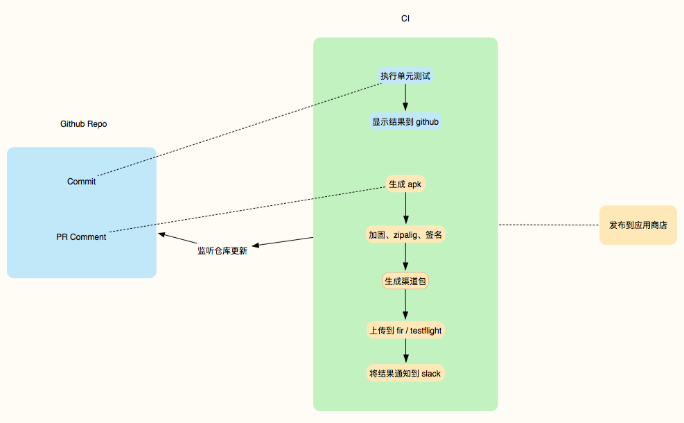
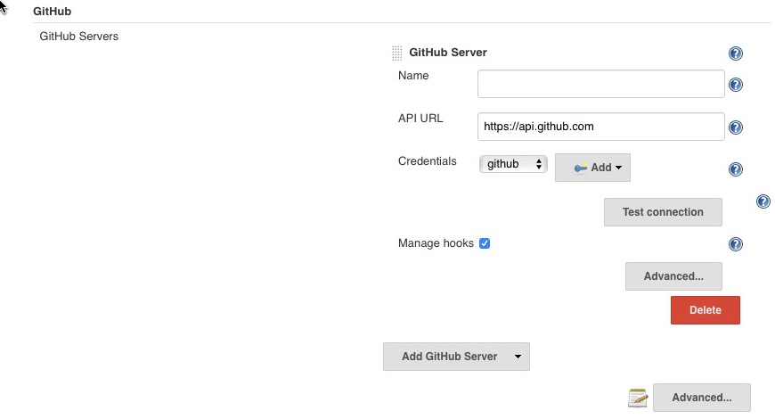
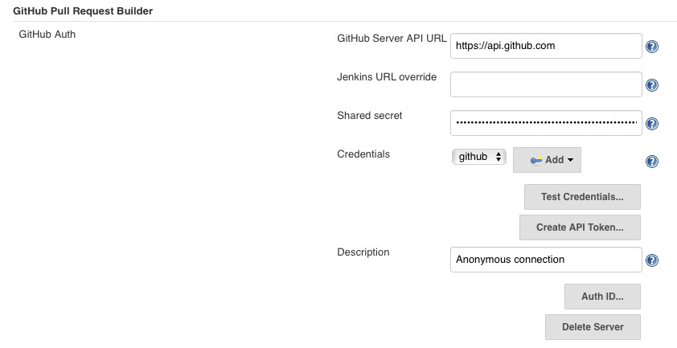
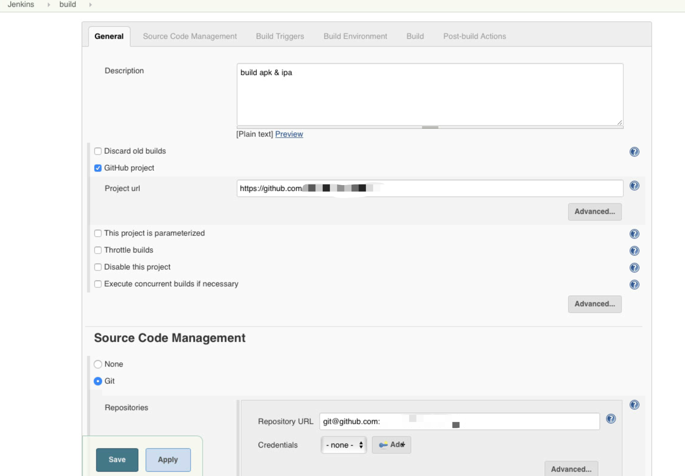
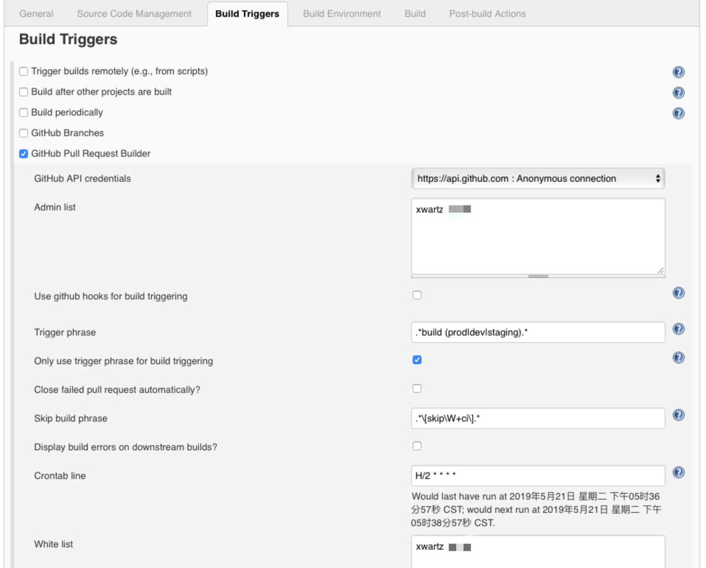

本篇文章主要讲如何使用 [Jenkins](https://jenkins.io/) 为 `React Native` 项目搭建 `CI/CD`。

涉及内容如下：

1. gitflow
2. Jenkins 搭建
3. 权限控制
4. 发布到测试平台
5. Android：打包、加固、zipalign、签名、多渠道包
6. iOS：证书、打包、发布
7. 自动生成 tag、release note

当然，上面的一些内容本身是为了项目的特定需求而做的，不一定适用其他项目。

另外，因为我自身并不是 DevOps 和原生 App 开发者，所以可能存在一些错误使用。

## 需求

任何功能的产生必定从需求开始，开发者根据明确的需求，来做技术调研和实现方案。

对于一家普通的小公司，`CI/CD` 的需求可能如下：

1. 实时得对提交到 `Github Repo` 的代码执行单元测试，并反馈结果到 `Commit`、`PR`
2. 代码 review 阶段可以触发打包，如 `PR` 下评论
3. 有不同的开发环境，因此需要打不同环境的包(`dev`、`staging`、`production`)
4. 将打好的包发布到测试平台，并通知相关人员进行测试
5. 如果是 production 的包，需要自动提交到应用商店
6. Android 需要发布多个平台，因此需要多渠道包

对于去中心化钱包，有更严格的*安全需求*：

1. **避免代码泄露，禁止第三方可触达**
2. **权限管理，控制触发打包的人员权限**

因此，出于以上安全需求的考虑，不使用第三方的服务，而是购买一台 [Mac Pro](https://www.apple.com/mac-pro/) 通过 `Jenkins` 自己搭建 `CI`，还能节省不少支出。

## 概览



选择使用监听仓库更新的方式，而不是通过 `webhooks`，主要出于安全考量。

## 触发方式

`CI` 本身是被动的执行者，执行任务的过程是由触发开启的，然后周而复始的工作着，
替代人力去做重复的事。

提高效率的同时，也为了避免一些人容易犯的低级错误。

上图中，我们主要通过两种方式触发 `CI`：

#### 1. push commit

当有新的代码提交时，希望能够实时的反馈该修改是否对原有的代码造成破坏，
因此触发 `CI` 执行单元测试任务。

#### 2. PR 下评论

当有人创建 `Pull Request` 时，相关人员会进行 `code review`，
并可能指派人员打包给到 QA 进行测试。

此时，可通过在 PR 下评论 `build dev` | `build staging` | `build prod`，
来触发 `CI` 基于此 PR 打对应环境的包。


> 触发方式需要根据团队的开发规范、gitflow 来适配，以上是基于前文的[团队开发规范](../developmemt-guidelines)。


## Jenkins 搭建

### 基础

首先，我们需要一个可编译 RN 项目的环境，因此需在 Mac 上安装一些基础软件：

1. [Xcode](https://developer.apple.com/xcode/)
2. [Android Studio](https://developer.android.com/studio)
3. [Homebrew](https://brew.sh/)
4. [pod](https://cocoapods.org/)：`sudo gem install cocoapods`
6. java：`brew cask install caskroom/versions/java8`
7. gradle：`brew install gradle`
8. git：`brew install git`
9. nodejs：`brew install node`
10. yarn：`brew install yarn`
11. fastlane：`gem install fastlane -NV`

### 编译配置

这里就不展开讲如何配置编译 RN 了，可以参考以下链接：

**iOS:**

- [Running On Device](https://facebook.github.io/react-native/docs/running-on-device)
- [iOS 证书设置指南](https://docs.jiguang.cn//jpush/client/iOS/ios_cer_guide/)

**Android:**

- [Sign your app](https://developer.android.com/studio/publish/app-signing)
- [Publishing to Google Play Store](https://facebook.github.io/react-native/docs/signed-apk-android)

### 安装 Jenkins

推荐使用 brew 安装

```bash
brew install jenkins
```

### 启动 Jenkins

```bash
jenkins --httpPort=4567
```

浏览器打开 <http://localhost:4567/>，创建账户(注意保管)。

### 安装 Plugin

进入 Jenkins 插件管理页面，http://localhost:4567/pluginManager/

**只安装必要的插件，其他通过自己编写脚本实现，这是为了：**

1. 不过度依赖 Jenkins，即使没有 Jenkins，也可在自己电脑执行
2. 更灵活，方便迁移到其他 CI

因此，只需要装以下两个插件即可。

**1. GitHub Plugin**

我们需要对 github 仓库做 clone、push 等操作，首先安装 [GitHub Plugin](https://wiki.jenkins.io/display/JENKINS/Github+Plugin)。

配置：``Manage Jenkins`` -> ``Configure System`` -> ``GitHub``



需要去 github 设置页面生成 [personal access token](https://github.com/settings/tokens/new)。

**2. GitHub pull request builder plugin**

监听 PR 的评论，执行相关的指令，并且需要控制权限，可安装 [GitHub pull request builder plugin](https://wiki.jenkins.io/display/JENKINS/GitHub+pull+request+builder+plugin)。

配置：``Manage Jenkins`` -> ``Configure System`` -> ``GitHub pull requests builder``



### 创建项目

#### 创建一个 Freestyle 项目

以打包 RN 为例：



1. 配置 github 仓库信息：仓库地址；触发 `branch` 使用 `**`
2. 设置构建触发器 `Build Triggers`

#### 触发与权限控制

设置 build triggers



1. 选择 `GitHub Pull Request Builder`，Jenkins 会监听 `PR` 的操作，例如添加评论。
2. 设置 `Admin list`：非 Admin 人员在 github 创建 `PR` 时，Jenkins 会在 `PR` 下添加一条评论 `Can one of the admins verify this patch?`
3. 设置 `Trigger phrase`：当在 `PR` 下评论该触发词，就会触发后续的构建脚本
4. 设置轮询时间 `Crontab line`
5. 设置权限：只有白名单人员在 `PR` 下评论才能触发

#### 执行脚本

通过 Jenkins `Execute shell` 执行编写好的构建脚本。

### 自动重启

`CI` 机器可能意外关机重启，例如：公司断电、不小心触碰插线板等。

因此，需要在重启打包机器后，自动重启 `CI`，在 Mac 重启启动项里设置执行启动脚本：

```bash
jenkins --httpPort=4567
```

## 脚本

编写的脚本应该使用最基础的语言，例如 `bash`、`make`，以及基础 `nodejs`。

不应该使用 `nodejs` 的一些第三方库，增加脚本依赖与复杂度。

### 测试

单元测试：推荐使用 `Jest`

e2e：推荐使用 `detox`

项目里编写好执行脚本，在 Jenkins `Execute shell` 下配置即可。

### 打包

当在 `PR` 下评论 ``build dev`` | ``build staging`` | ``build prod`` 时，
就会触发：

1. 自动升级版本号(build + 1)
2. 将 `1` 的修改，提交 commit 到仓库
3. 打出相应的版本
4. 根据 commit 生成 changelog
5. 将 apk 和 ipa 文件上传到 [fir](https://fir.im/apps)
6. 将版本信息通知到 [slack](https://slack.com)，供 QA 下载测试

可通过 [fastlane](https://github.com/fastlane/fastlane/) 解决升级版本号、根据 commit 生成 changelog、提交到 fir 等问题。

**可用的插件，如下：**

- [fastlane-plugin-versioning](https://github.com/SiarheiFedartsou/fastlane-plugin-versioning)
- [fastlane-plugin-versioning_android](https://github.com/beplus/fastlane-plugin-versioning_android)
- [fastlane-plugin-firim](https://github.com/whlsxl/firim)


打包的具体流程 iOS 和 Android 有很大不同。

**iOS：**

iOS 相对来说简单很多，配置好证书问题，完全可通过 fastlane 生成 ipa 文件，
并发布到 fir 和 testflight。

**Android：**

Android 复杂很多，涉及以下流程，并且需要手动编写脚本解决。

#### 1. 生成 apk

`app/build.gradle` 文件配置后，执行

```bash
./gradlew assembleRelease
```

#### 2. 加固

加固是对应用程序进行深度加密处理，防止应用在上线后被反编译、破解、恶意篡改、二次打包和内存截取等多种威胁，保护数据信息不轻易被黑客窃取。

可使用「360 加固保」，官网下载地址: [Mac 版本](https://jiagu.360.cn/#/global/download)。

将文件解压，我们真正需要的不是加固助手客户端，而是 `jiagu` 目录下的 `jar` 包。

有了 `jar` 包之后，我们就可以编写脚本来完成加固，而不需要通过客户端上传。

```bash
apkPath=$1
apkName=$2

java -jar ~/work/jiagu/jiagu.jar -jiagu ${apkPath}/${apkName}.apk ${apkPath}
mv ${apkPath}/${apkName}_*_jiagu.apk ${apkPath}/${apkName}-jiagu-sign.apk
```

执行加固之后，生成 `app-release-jiagu-sign.apk`

#### 3. zipalign

[zipalign](https://developer.android.com/studio/command-line/zipalign) 是 Android SDK 自带的工具，用于优化应用与 Android 系统的交互效率，提高应用运行性能。

**上架 Google Play 必须经过 zipalign 工具优化**

```js
const zipalign = '~/Library/Android/sdk/build-tools/27.0.3/zipalign'
const zalign = (apkName, apkPath) => {
  console.log('zipalign...')
  const suffix = 'jiagu-zipalign.apk'
  execSync(`${zipalign} -v 4 ${apkPath}/${apkName}-${jiaguSuffix} ${apkPath}/${apkName}-${suffix}`)

  console.log('rename zipalign apk...')
  execSync(`mv ${apkPath}/${apkName}-${suffix} ${apkPath}/${apkName}-${jiaguSuffix}`)
}
```

执行 zipalign 生成 `app-release-jiagu-zipalign.apk`，重命名为 `app-release-jiagu-sign.apk`。

#### 4. 签名

经过 `加固` 和 `zipalign` 后的 apk，需要重新签名，签名可参考 [Sign your app](https://developer.android.com/studio/publish/app-signing)。

签名过程需要交互式的输入 `keystore` 密码，脚本使用 `expect` 编写，简单教程可见 [Basic principles of using tcl-expect scripts](https://gist.github.com/Fluidbyte/6294378)。

```expect
#!/usr/bin/expect

set user root
set passwd [lindex $argv 0]
set signer [lindex $argv 1]
set keystore [lindex $argv 2]
set apkPath [lindex $argv 3]

spawn ${signer} sign -ks ${keystore} ${apkPath}
expect "Keystore password for signer #1:"
send "${passwd}\r"

interact
```

#### 5. 多渠道包

如果在 `build.gradle` 文件配置 `productFlavors` 渠道信息，那么生成每个渠道包都必须重新执行一次编译。

也就是说如果有 10 个渠道，一个渠道包需要 4 分钟，那么就需要 40 分钟完成一次打包，十分耗时，必须寻找其他方式。

目前生成渠道包的方案用的是美团的 [walle](https://github.com/Meituan-Dianping/walle)，原理是在 `APK Signing Block` 区块写入渠道信息，
然后在统计的时候，读取渠道信息。

更多详细信息可参考： [新一代开源 Android 渠道包生成工具 Walle](https://tech.meituan.com/2017/01/13/android-apk-v2-signature-scheme.html)。

> 使用 `walle` 后，渠道信息不能再以 `AndroidManifest.xml` 配置为准，必须从 `APK Signing Block` 区块获取渠道信息后，动态设置。

#### 6. 发布到应用商店

由于国内应用商店不开放接口，所以大部分还是需要手动上传。

### 通知结果

当生成的 apk/ipa 包上传到 fir 后，[通过 fir 接口](https://fir.im/docs/apps_show)，获取新上传的包信息，
将信息组装成 slack 接收的格式，发送到 slack channel。

### 生成 release note

为了生成可读性强的 release note，`commit message` 需要遵循约定好的规范。

开源社区有很多不错的规范，这里比较推荐 [Angular Commit Message Guidelines](https://github.com/angular/angular/blob/master/CONTRIBUTING.md#commit)，文档齐全、详细。

并且，我们可以利用 [conventional-changelog](https://github.com/conventional-changelog/conventional-changelog) 来生成如下可读性不错的 changelog。

```
Features
  - support dynamic directive arguments for v-on, v-bind and custom directives (#9373)

Improvements
  - improve scoped slots change detection accuracy (#9371)

Bug Fixes
  - fix checkbox event edge case in Firefox (#1868)
```

我在文章 [团队开发规范](../developmemt-guidelines) 里有更多说明，这里就不展开说了。

生成 changelog 脚本 `gen-release-note.js` 如下：

```js
const version = process.argv[2] || process.env.VERSION
const cc = require('conventional-changelog')
const file = `./RELEASE_NOTE${version ? `_${version}` : ``}.md`
const fileStream = require('fs').createWriteStream(file)
cc({
  preset: 'angular',
  pkg: {
    transform(pkg) {
      pkg.version = `v${version}`
      return pkg
    }
  }
}).pipe(fileStream).on('close', () => {
  console.log(`Generated release note at ${file}`)
})
```

### 生成 tag

新版本发布之后，自动生成 git tag，并将 tag 和 release note 更新至 github。

```bash
#!/bin/bash
set -e

if [[ -z $1 ]]; then
  echo "Enter new version(SemVer): "
  read -r VERSION
else
  VERSION=$1
fi

read -p "Releasing $VERSION - are you sure? (y/n) " -n 1 -r
echo

if [[ $REPLY =~ ^[Yy]$ ]]; then
  echo "Releasing $VERSION ..."

  # generate release note
  node ./scripts/gen-release-note $VERSION

  # format message
  rNote="$(cat RELEASE_NOTE_$VERSION.md)"
  rNote=${rNote//\#\#\#/👉}
  rNote=${rNote/\#\#/👇👇}

  # add tag version
  git tag -a "v$VERSION" -m "$rNote"

  # publish
  git push origin refs/tags/v"$VERSION"
fi

```

## 总结

在如上的流程中，基本实现了针对 RN 项目的自动化构建，能有效提升开发效率，使开发流程更可靠。

当然，还有很多优化的点，例如：

1. 使用 docker 将环境隔离开
2. Android 各个渠道自动发布
3. 自动提交版本日志到应用商店
4. ...


## 参考

- [Running On Device](https://facebook.github.io/react-native/docs/running-on-device)
- [Sign your app](https://developer.android.com/studio/publish/app-signing)
- [Publishing to Google Play Store](https://facebook.github.io/react-native/docs/signed-apk-android)
- [zipalign](https://developer.android.com/studio/command-line/zipalign)
- [新一代开源 Android 渠道包生成工具 Walle](https://tech.meituan.com/2017/01/13/android-apk-v2-signature-scheme.html)
- [Basic principles of using tcl-expect scripts](https://gist.github.com/Fluidbyte/6294378)
- [Jenkins doc](https://jenkins.io/doc/)
- [使用Jenkins搭建iOS/Android持续集成打包平台 | DebugTalk](https://debugtalk.com/post/iOS-Android-Packing-with-Jenkins/)
- [构建完成后 github commit status 设置不成功](https://stackoverflow.com/questions/14274293/show-current-state-of-jenkins-build-on-github-repo)
- [fastlane](https://github.com/fastlane/fastlane/)
