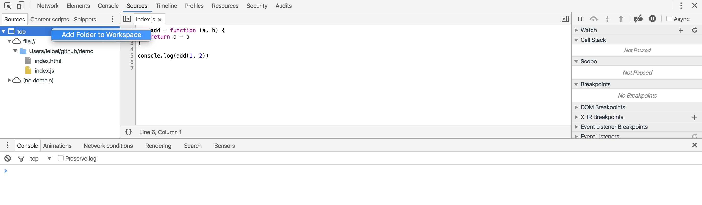

其实已经很久没有使用 Chrome 的 source-map 功能了。

`webpack` 非常火，它提供的 `HMR`(hot module replacement) 功能非常棒，修改代码无需刷新页面。那么在 `webpack` 出现之前，有什么好的方法呢。

作为前端开发，`Chrome` 应该是大家最喜欢的浏览器之一，调试代码非常方便。

这篇文章主要介绍下，`Chrome` 浏览器自带的 `source-map` 功能。

如果你的项目已经用 `webpack` 了，那就不太需要使用这个功能了，`webpack` 提供的 `HMR` 功能，开发起来很方便。

### 添加文件夹到 Workspace

右键选择 `Add Folder to Workspace`

并允许访问权限

### 建立 Map

右键选择 `Map to Network Resource...`，选择对应的文件。

如此便已有了 `source-map` 功能

只需要建立某个 `map` 的文件，`Chrome` 会为把整个目录下的文件都建立 `map` 关系。

### 尝试修改

选择某个文件，修改代码，`cmd + s` 保存，然后你会发现编辑器里的代码也更新了。

或者，更新编辑器里的代码，`cmd + s` 保存，网页中的代码也相应的更新了。

当然它并没有 `webpack` 这样的 `HMR` 功能，如果想看到代码更新后的效果，还是需要刷新页面的。

### 真正用途

可能在对于 `js` 代码来说以上的 `map` 用处似乎并不大。

所以这个功能大多是在修改 `css` 代码的时候使用，

你可以直接看着页面，在控制台修改 `css` 代码就好了，都不需要去修改编辑器里的文件了。

**Chrome 的这个功能还支持 `sass`，可以 `map` 到源代码，如果写 `sass` 的话，强力推荐。**

其实你还可以在控制台删除，增加文件，参考 [Workspaces - Persistent authoring in the DevTools](https://developer.chrome.com/devtools/docs/workspaces)。
